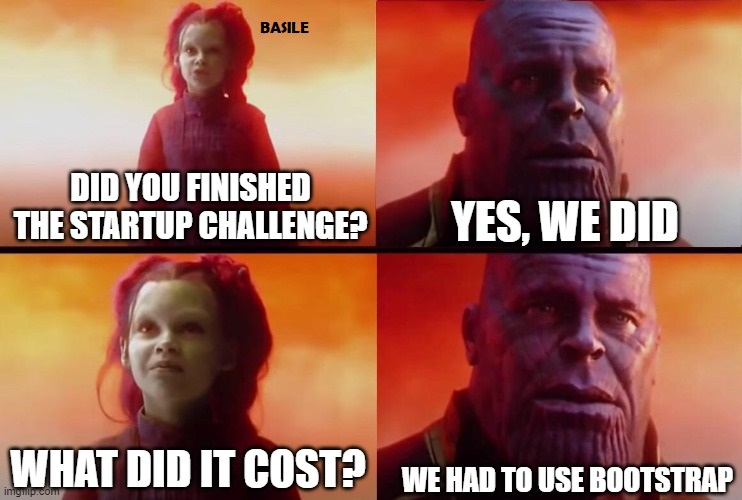

#    ALAKAZAM

### 🎬 WHAT?

Alakazam is a search application that can identify the movie you are looking for based on keywords or short samples provided by the user.

Movie industry continues to grow, and as the offer increases, it becomes more difficult to refine searches for specific movies using very little information on the user-side. Whether you are looking for a childhood film that you only remember a side plot or a B movie that you saw in an obscure festival, we can find it for you!

### 🎬 HOW?

Using our website or mobile application, users can enter a text input with the information they have about the movie: keywords, actors, director, year, plot… you can use anything!

### 🎬 WHO?

We are the kind of people who constantly forget the films we watch and need an easy way to find lost memories! 😅

That's why we created Alakazam!
Alakazam is a search application that can identify the movie you are looking for based on keywords or short samples provided by the user.

#### Did we got your attention? Check our page [here](https://alakazam-startup.netlify.app/).
&nbsp;  

# VEROU 5 - STARTUP CHALLENGE

This exercise is part of the Junior Web Development training, on the BeCode organization. The challenge was to create a startup and deploy a website in 3 days. The complete guidelines can be found in [here](https://github.com/becodeorg/GNT-Verou-5/tree/main/1.The-Field/08.The-startup). Our results can be found on [this repository](https://github.com/eduardabp/Alakazam) and on this [website](https://alakazam-startup.netlify.app/).

### 💻 TEAM

This group was formed by Sylvie, Funda, Mohamed and Eduarda. Each of us builded a part of the website, as follows:

SYLVIE - Homepage  
FUNDA - About Us page  
MOHAMED - Most Alakazamed page  
EDUARDA - Mockup Search page and Contact page  

### 💻 TOOLS

For this challenge, we used the following tools:

- HTML
- CSS
- BOOTSTRAP
- SASS
- [SNAZZYMAPS](https://snazzymaps.com/)
- GOOGLE MAPS API
- [FORMSPREE](https://formspree.io/)
- GIT / GITHUB
- FREEPIK
- VIDNOZ

### 💻 CHALLENGES COMPLETED

##### &emsp; 🎯 CSS ANIMATIONS
##### &emsp; 🎯 CSS TRANSITIONS
##### &emsp; 🎯 CAROUSEL
##### &emsp; 🎯 CONTACT FORM BY FORMSPREE
##### &emsp; 🎯 CALL THE PHONE NUMBER WHEN CLICKED ON IT
##### &emsp; 🎯 EMAIL APPLICATION OPENS WHEN CLICKED ON EMAIL ADDRESS
##### &emsp; 🎯 GOOGLE MAPS ON CONTACT PAGE (WITH PINNED LOCATION)
##### &emsp; 🎯 WEBSITE IS RESPONSIVE  
&nbsp;  
&nbsp;  

  

&nbsp;  
This is a repository created to show the results of the Startup Challenge on BeCode Junior Web Dev bootcamp. Challenge completed on 20/10/2023.